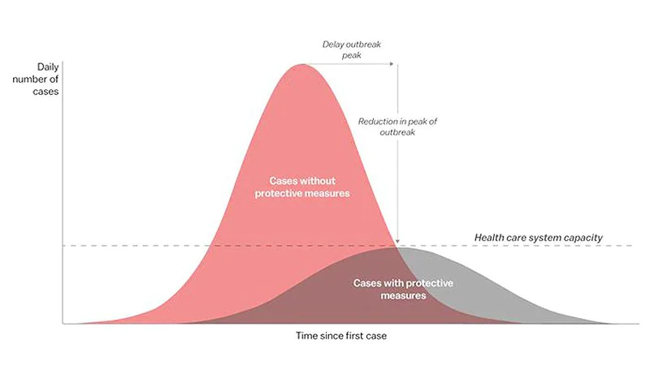
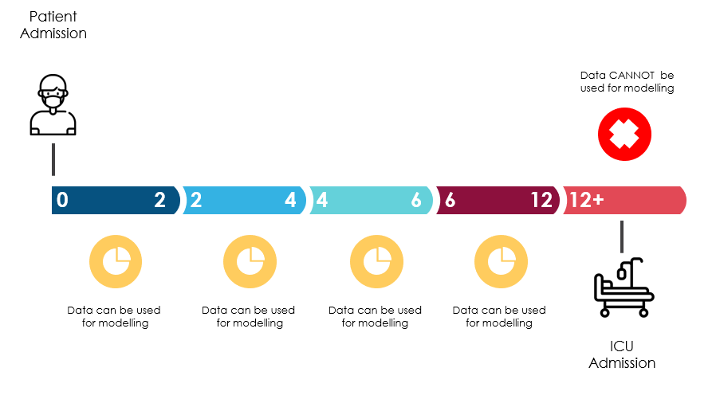
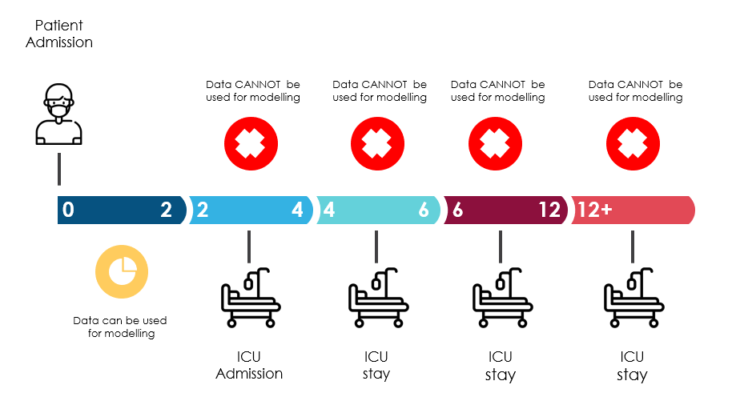

🚧 Em construção 👷‍♂️

# COVID-19 - Clinical Data to assess diagnosis

Esse projeto é uma pequena ramificação da problematica encontrada com os dados que foram disponibilizados pelo Hospital Sírio Libanês - São Paulo e Brasília, no [Kaggle](https://www.kaggle.com/S%C3%ADrio-Libanes/covid19https://www.kaggle.com/S%C3%ADrio-Libanes/covid19)

Todo mundo sabe que a pandemia de COVID-19 atingiu o mundo inteiro, sobrecarregando os sistemas de saúde - despreparados para uma solicitação tão intensa e demorada de leitos de UTI, profissionais, equipamentos de proteção individual e recursos de saúde.

O Brasil registrou o primeiro caso COVID-19 em 26 de fevereiro e atingiu a transmissão na comunidade em 20 de março.

Há urgência na obtenção de dados precisos para melhor prever e preparar os sistemas de saúde e evitar colapsos, definidos pela necessidade de leitos de UTI acima da capacidade (presumindo-se que haja recursos humanos, EPIs e profissionais disponíveis), utilizando dados clínicos individuais - em vez de dados epidemiológicos e populacionais. traduzido e adaptado da Description do projeto no [Kaggle](https://www.kaggle.com/S%C3%ADrio-Libanes/covid19https://www.kaggle.com/S%C3%ADrio-Libanes/covid19) - acesso: 03/08/2021

## O objetivo

Nosso objetivo aqui será criar um modelo capaz de prever quais pacientes precisarão ser admitidos na unidade de terapia intensiva e assim, definir qual a necessidade de leitos de UTI do hospital, a partir dos dados clínicos individuais disponíveis.

## Os dados

### Label output
A UTI (ICU) deve ser considerada, como primeira versão desse conjunto de dados, ou seja, será nossa variável de destino.

### Window Concept

Houve o cuidado de incluir cenários da vida real com janela de eventos e dados disponíveis.
Os dados foram obtidos e agrupados

 patient
- patient encounter
- aggregated by windows in chronological order

<table>
<thead>
<tr>
<th>Window</th>
<th>Description</th>
</tr>
</thead>
<tbody>
<tr>
<td>0-2</td>
<td>From 0 to 2 hours of the admission</td>
</tr>
<tr>
<td>2-4</td>
<td>From 2 to 4 hours of the admission</td>
</tr>
<tr>
<td>4-6</td>
<td>From 4 to 6 hours of the admission</td>
</tr>
<tr>
<td>6-12</td>
<td>From 6 to 12 hours of the admission</td>
</tr>
<tr>
<td>Above-12</td>
<td>Above 12 hours from admission</td>
</tr>
</tbody>
</table>

Não vamos usar os dados quando a variável de destino estiver presente, pois a ordem do evento é desconhecida (talvez o evento de destino tenha acontecido antes dos resultados serem obtidos). Eles foram mantidos lá para que possamos aumentar este conjunto de dados em outros resultados posteriormente.

### Dataset
Este conjunto de dados contém dados anônimos do Hospital Sírio-Libanês, São Paulo e Brasília. Todos os dados foram tornados anônimos de acordo com as melhores práticas e recomendações internacionais.
Os dados foram limpos e escalados por coluna de acordo com Min Max Scaler para caber entre -1 e 1.
